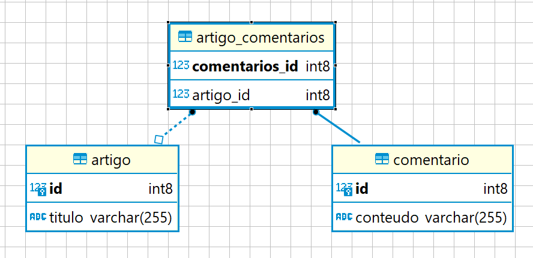
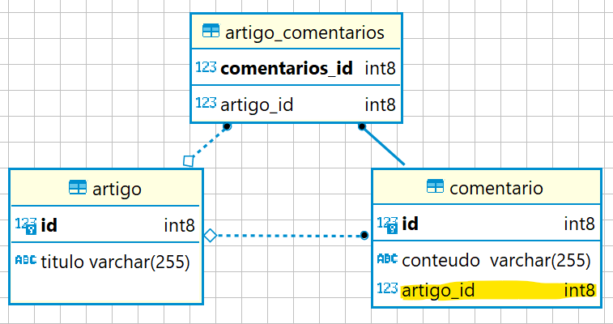

# Relacionamento bidirecional com JPA e Hibernate

Agora vamos entender como podemos mapear um relacionamento bidirecional com JPA e Hibernate, qual seu impacto no nosso modelo orientado a objetos e principalmente no nosso modelo relacional. Além disso, vamos refletir sobre alguns cuidados e boas práticas no seu uso.

## Navegando entre as duas pontas do relacionamento

Imagine que precisemos implementar um site de noticias ou blog que nos permita escrever artigos e também permita que nossos leitores comentem cada postagem que fazemos. Dessa forma, não seria improvável que este site de noticias tivesse um modelo de domínio mapeado com JPA como abaixo:

```java
@Entity
class Artigo {

    @Id
    @GeneratedValue
    private Long id;

    private String titulo;
    private String conteudo;

    @OneToMany(cascade=.ALL)
    private List<Comentario> comentarios;

}

@Entity
class Comentario {

    @Id
    @GeneratedValue
    private Long id;

    private String conteudo;
}
```

Se olharmos para o schema no banco de dados compatível com o mapeamento acima, teríamos um modelo como abaixo:



Atualmente, podemos recuperar todos os comentários de um artigo através do relacionamento existente entre
eles: este relacionamento, **um para muitos**, foi mapeado através da anotação `@OneToMany`. Dessa forma, sempre
que invocarmos o método `getComentarios` de uma instância de `Artigo` a JPA nos devolverá todos os comentários
associados a ele. Podemos ver isto no código abaixo:

```java
Artigo artigo = entityManager.find(Artigo.class, 42);
System.out.println("Total de comentários: " + artigo.getComentarios().size());
```

Ou poderíamos recuperar todos os comentários através de uma consulta dinâmica JPQL ou mesmo uma
named query, como no código a seguir:

```java
List<Comentario> comentarios = entityManager
    .createQuery("select comentario from Artigo a "
            + " join a.comentarios as comentario "
            + " where b.id = :id", Comentario.class)
    .setParameter("id", id)
    .getResultList();

System.out.println("Total de comentários: " + comentarios.size());
```

Repare que neste mapeamento, um `Artigo` tem ciência de seus comentários, mas cada `Comentario` não sabe a
qual artigo ele está associado e, algumas vezes, se faz necessário que a entidade "filha" tenha conhecimento de sua entidade "pai", como no exemplo a seguir:

```java
Comentario comentario = entityManager.find(Comentario.class, 3);
System.out.println("Artigo: " + comentario.getArtigo());
```

Para conseguir isto, primeiramente, teríamos que modelar o relacionamento na outra ponta do relacionamento,
no nosso caso, modelar uma relação **muitos para um** entre `Comentario` e `Artigo`. Assim teríamos:

```java
@Entity
public class Comentario {

    // demais atributos

    private Artigo artigo;
}
```

Mas apenas isso não é suficiente, pois a JPA não entende o que este atributo representa. Para que a JPA
entenda este relacionamento, precisamos mapeá-lo através da anotação `@ManyToOne` (o oposto da `@OneToMany`, é
claro). No fim, nosso código ficaria:

```java
@Entity
public class Comentario {

    // demais atributos
    
    @ManyToOne
    private Artigo artigo;
}
```

Com isso, sempre que carregarmos um objeto do tipo `Comentario`, nós poderemos recuperar o artigo a qual
ele está associado. Indo mais longe, nós também podemos escrever consultas mais simples, já que podemos
escrevê-las partindo da entidade `Comentario` e não mais de `Artigo`:

```java
List<Comentario> comentarios = this.manager
    .createQuery("select c from Comentario c "
            + " where c.artigo = :artigo", Comentario.class)
    .setParameter("artigo", artigo)
    .getResultList();

System.out.println("Total de comentários: " + comentarios.size());
```

Ter o mapeamento nas duas pontas pode ajudar em consultas mais complexas ou facilitar a escrita de lógicas de negócio dentro da aplicação.

## Relacionamento bidirecional

Ao fazer o mapeamento acima algumas mudanças inesperadas ocorrem no schema do banco de dados e nos comandos SQL gerados pelo Hibernate. Por exemplo, a partir de agora além da tabela de junção `ARTIGO_COMENTARIOS` criada por padrão pelo mapeamento `@OneToMany`, o Hibernate também criou uma coluna de junção (FK) na tabela `COMENTARIO` para a PK da tabela `ARTIGO`:



Para JPA, existem dois relacionamentos unidirecionais: um relacionamento **um para muitos** entre `Artigo` e `Comentario`, representado através da tabela `ARTIGO_COMENTARIOS` e um outro relacionamento **muitos para um**, representado através da coluna com chave estrangeira (FK) `artigo_id` na tabela `COMENTARIO`.

Contudo, não é isso que desejamos. Precisamos que a JPA interprete estes dois relacionamentos como se
fossem o mesmo, como se fossem um **relacionamento bidirecional**. Para isso, temos que definir o atributo `mappedBy` da anotação `@OneToMany`, cujo valor indica o atributo que representa a outra ponta do relacionamento. O mapeamento da entidade `Artigo` mudará para:

```java
@Entity
public class Artigo {

    // demais atributos

    @OneToMany(
        cascade=CascadeType.ALL,
        mappedBy="artigo" // define um relacionamento bidirecional
    )
    private List<Comentario> comentarios;
}
```

Ao tornar o relacionamento bidirecional via atributo `mappedBy` da anotação `@OneToMany` a JPA vai entender que se trata de um único relacionamento no modelo orientado a objetos como também no modelo relacional. Mas a pergunta que fica é: como o Hibernate gerou o schema do banco de dados?

Para a JPA, em um relacionamento bidirecional, a classe que define o atributo `mappedBy` é considerada o **lado fraco da relação**, também chamado de _inverse side_. Enquanto a outra classe, cujo o atributo é indicado pelo
`mappedBy`, é considerada o **lado forte da relação**, também chamado de _owning side_. No nosso caso, o lado forte é a entidade `Comentario`, enquanto o lado fraco é a entidade `Artigo`. No fim, quando o Hibernate olhar para o schema do banco de dados, ele espera encontrar uma coluna FK na tabela `COMENTARIO`:


Entenda o lado forte da relação como a classe que define o mapeamento no banco de dados. Normalmente, através das anotação `@JoinColumn`, para uma coluna de junção, ou `@JoinTable`, para uma tabela de junção. Por padrão, em um relacionamento bidirecional **um para muitos**, será criada uma coluna de junção na entidade dona da relação.

Lembre-se, por lado forte da relação ser a entidade `Comentario` na qual está mapeada como `@ManyToOne`, por padrão ele adota uma coluna de junção no modelo relacional. Caso você queira customizar algo nessa coluna ou mesmo substituir por uma tabela de junção basta anotar o relacionamento com `@JoinColum` ou `@JoinTable` como abaixo:

```java
@Entity
public class Comentario {

    // demais atributos
    
    @JoinTable(...) // define uma tabela de junção
    @ManyToOne
    private Artigo artigo;
}
```

Um detalhe que confunde um pouco os desenvolvedores, é que em um relacionamento bidirecional a JPA entra em discordância com o modelo de domínio. O que estou querendo dizer é que para domínio, para o negócio, o lado forte da relação é claramente a classe `Artigo`, enquanto o lado fraco é a classe `Comentario`.

## Trabalhando de forma orientada a objetos com relacionamento bidirecional

É muito comum termos problemas ao trabalhar com relacionamentos bidirecionais, pois agora sempre que
adicionarmos um novo objeto a uma associação, precisaremos deixar as duas pontas do relacionamento cientes.

Imagine que precisamos adicionar um novo comentário a uma instância de `Artigo`. Quando estavámos trabalhando com um relacionamento unidirecional, bastávamos escrever um código desse tipo:

```java
Comentario comentario = new Comentario();

Artigo artigo = entityManager.find(Artigo.class, 1); // usar um ID que exista no banco
artigo.getComentarios().add(comentario);

entityManager.merge(artigo);
```

E a JPA se responsabilizava de persistir corretamente no banco de dados o comentário já associado ao artigo.
Contudo, em um relacionamento bidirecional nossos objetos estariam em um **estado inconsistente**, e a JPA
não saberia como construir a relação entre eles no banco, pois apenas o `Artigo` sabe que o `Comentario` pertence ao relacionamento. Para que o `Comentario` também saiba que está em um relacionamento, precisamos alterar nosso código para:

```java
Comentario comentario = new Comentario();

Artigo artigo = entityManager.find(Artigo.class, 1);

comentario.setArtigo(artigo); // filho conhece o pai
artigo.getComentarios().add(comentario); // pai conhece o filho

entityManager.merge(artigo);
```

O código acima não é complexo, contudo é muito fácil para um desenvolvedor(a) esquecer de definir a relação
em uma das pontas. Por isso, trabalhar com este tipo de relação é delicado e propício a erros.

Para minimizar os problemas de inconsistência, podemos aplicar um pouco de orientação a objetos, de tal forma
que, ao adicionar um novo comentário em um artigo, ambos os objetos fiquem cientes do relacionamento. Para
isso, primeiramente, precisamos definir um método na classe `Artigo` responsável por adicionar um novo `Comentario` à coleção. No final, queremos que o nosso código fique semelhante a este:

```java
Comentario comentario = new Comentario();

Artigo artigo = entityManager.find(Artigo.class, 1);
artigo.adiciona(comentario);
```

Daí, na classe `Artigo`, teríamos a implementação do método `adiciona` desta maneira:

```java
@Entity
class Artigo {

    // ...

    public void adiciona(Comentario comentario) {
        comentario.setArtigo(this);
        this.comentarios.add(comentario);
    }
}
```

O método adiciona teria uma responsabilidade bem definida e garantiria a consistência do nosso relacionamento. Esse mesmo design orientado a objetos também pode ser utilizado para a lógica de remoção de um comentário para garantir a consistência entre os objetos, como podemos ver aqui:

```java
@Entity
class Artigo {

    // ...

    public void remove(Comentario comentario) {
        comentario.setArtigo(null);
        this.comentarios.remove(comentario);
    }
}
```

Embora não seja obrigatório, nós podemos ir até mais longe blindando nosso código contra modificações indevidas: para que nenhum desenvolvedor(a) acabe trabalhando diretamente com a coleção sem passar pelo novo método, precisamos remover o método `setComentarios` e, se possível, retornar uma cópia segura ou imutável da coleção ao invocar o método `getComentarios`. Nosso código ficaria como a seguir:

```java
@Entity
class Artigo {

    // ...

    public List<Comentario> getComentarios() {
        // retorna cópia segura e imutável da coleção
        return Collections.unmodifiableList(this.comentarios);
    }

    // remove o método setComentarios()
}
```

Com essa abordagem, conseguimos forçar o desenvolvedor(a) a usar sempre o método `adiciona` e `remove` e, caso ele tente
modificar a coleção diretamente, uma exceção será lançada:

```java
Artigo artigo = entityManager.find(Artigo.class, 1);
artigo.getComentarios().remove(1); // lança uma UnsupportedOperationException
```

Repare que, em um relacionamento bidirecional, **a responsabilidade de garantir a consistência dos relacionamentos e dos objetos é do desenvolvedor(a)** e não mais da JPA. Caso contrário, a persistência poderá não funcionar como esperado.

## Dicas do especialista

### Indo mais além com Domain-Driven Design

Podemos ir mais além no nosso código, fazendo-o se aproximar ainda mais do idioma usado no domínio do sistema. Por exemplo, o que na verdade estamos fazendo é _comentando_ um artigo, logo, poderíamos mudar o nome do método `adiciona` para `comenta`. E até mesmo, adicionar regras de negócio dentro do método, como abaixo:

```java
@Entity
class Artigo {

    // ...

    public void comenta(Comentario comentario) {

        if (comentario.getAutor() == null)
            throw new ComentarioSemAutorException();

        comentario.setArtigo(this);
        this.comentarios.add(comentario);
    }
}
```

Esta prática, de unificar a linguagem usada em código e usada pelos especialistas no negócio e desenvolvedores, é conhecida como **Domain-Driven Design (DDD)**. Através dessa linguagem úbiqua é possível diminuir o ruído na comunicação entre todos os membros da equipe.

### Cuidado com relacionamentos bidirecionais

Um relacionamento bidirecional entre classes é **uma decisão de design** e não necessariamente tem a ver
com persistência ou JPA. Decidir quando usar ou não vai depender de caso para caso, e em alguns casos pode
atrapalhar mais do que ajudar.

No caso da JPA, se usado corretamente, pode facilitar a escrita de consultas JPQL, diminuir idas ao banco
de dados, melhorar a performance gerando comandos SQL mais eficientes, ajudar em operações em cascata e até permitir que tenhámos regras de negócio mais claras em código. Isso dependerá do cenário e da necessidade do relacionamento.

Mas como já vimos, ter um relacionamento bidirecional também pode trazer algumas dificuldades com relação
a inconsistência dos objetos, pois esta responsabilidade passa a ser do desenvolvedor e não mais do framework
ORM. Se aplicarmos boas práticas de orientação a objetos, é possível garantir a consistência entre as duas pontas do relacionamento e ainda por cima ter um design mais enxuto das classes.

No geral, aconselhamos a evitar o mapeamento bidirecional com JPA sempre que possível, devido a possíveis
problemas de inconsistência. Mas, se sua aplicação precisa lidar com um alto throughput e baixa latência, sem dúvida relacionamento bidirecional se torna uma boa opção.

### Artigos que valem a pena a leitura

- [The best way to map a @OneToMany relationship with JPA and Hibernate](https://vladmihalcea.com/the-best-way-to-map-a-onetomany-association-with-jpa-and-hibernate/) 
- [Relacionamento bidirecional entre classes](https://blog.caelum.com.br/como-nao-aprender-orientacao-a-objetos-relacionamento-bidirecional/)
- [JPA: por que você deveria evitar relacionamento bidirecional](http://blog.triadworks.com.br/jpa-por-que-voce-deveria-evitar-relacionamento-bidirecional)